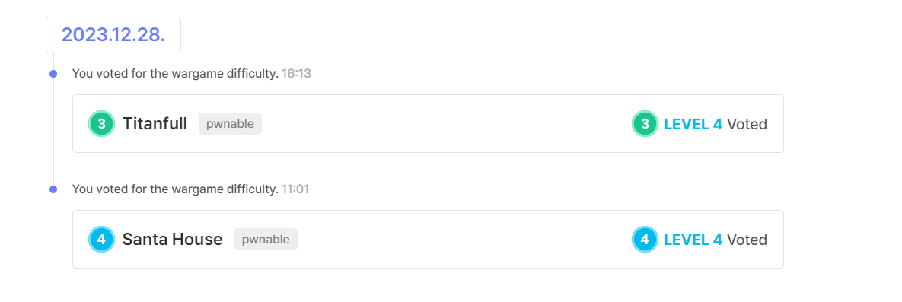
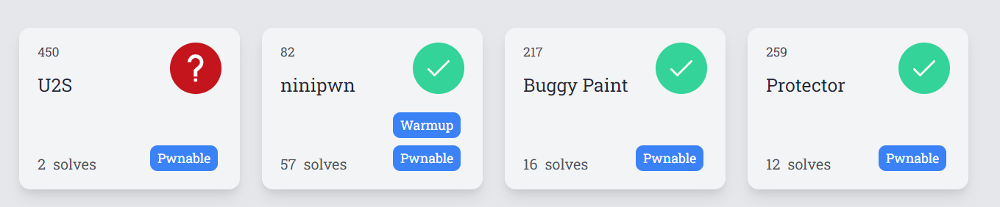

# kernel

- Tìm hiểu cơ bản về tương tác user-kernel, debug
- Tìm hiểu ret2usr, solve chall part 1
  https://github.com/wan-hyhty/kernel-training

# Write-up

## 2023 X-mas CTF

## Dreamhack CTF Season 5 Round #1 (🚩Div1)
- Race condition

## mapna ctf

## tetctf

